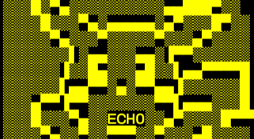

# Ech0
Uma ferramenta avançada para explorar e manipular sistemas, Nexus combina eficiência e discrição em um ambiente de hacking. Com interface intuitiva e recursos poderosos, permite que você se conecte a redes, execute scripts e analise dados.

#  <!-- Substitua pela URL da sua imagem de banner -->

# Validador de HTML e CSS

Uma ferramenta web simples para validar código HTML e CSS, permitindo que desenvolvedores verifiquem a conformidade de seu código de maneira fácil e rápida.

---

## Funcionalidades

- Validação de HTML e CSS utilizando `html-validator`.
- Resultados exibidos em tempo real na interface.
- Design intuitivo e responsivo.

---

## Pré-requisitos

### Dependências Necessárias

Antes de executar a ferramenta, certifique-se de que as seguintes dependências estão instaladas:

1. **Go (Golang)**: [Baixe aqui](https://golang.org/dl/).
2. **Node.js**: [Baixe aqui](https://nodejs.org/).

### Instalação do html-validator

Após instalar o Node.js, execute o seguinte comando para instalar o `html-validator`:

```bash
npm install -g html-validator
