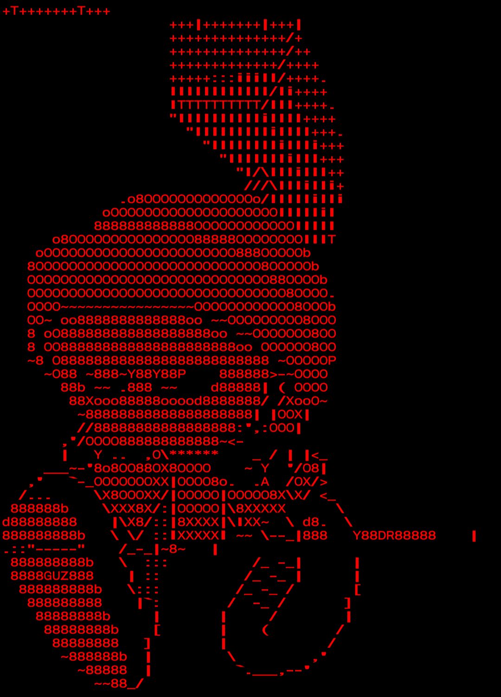

# Ech0
Uma ferramenta avançada para explorar e manipular sistemas, Nexus combina eficiência e discrição em um ambiente de hacking. Com interface intuitiva e recursos poderosos, permite que você se conecte a redes, execute scripts e analise dados.

#  <!-- Substitua pela URL da sua imagem de banner -->

# Ech0 v.000.002

Do experimento feito anteriormente, lançamos umw ferramenta feita pelo mesmo bot só que dessa vez uma ferramenta web (Roda em navegadores),usando programas parecido com Selenium,Puppeteer e Playwright.

---

## Funcionalidades

- Scraper web (Extrai informações de páginas web link, users,title) **Auxilia na injeção sqlmap**
- Cookie Checker (Extrai informações do cookie de uma página web) **Todas as informações**
- Verificador de Links Quebrados **Auxilia na verificação de vulnerabilidades**
- Validar HTML/CSS **Ajuda no estudo de estrutura web**

---

## Pré-requisitos

Talvez você precise instalar algumas dependências se algo não rodar bem.

- Abaixando (**opcional**):

1. **Instalar o Go**: [Baixe aqui](https://golang.org/dl/).
2. **Instalar o Node.js**: [Baixe aqui](https://nodejs.org/).
3. **Após instalar o Node.js instale o html-validator
```bash
   npm install -g html-validator
```

- Pelo Terminal (**recomendado**)

1. **Atualize os pack's**:
```bash
pkg upgrade && pkg update
```
2. **Instale Golang**:
```bash
pkg install golang
```
3. **Instale Node.js**:
```bash
pkg install nodejs
```

- Dependência da Ferramenta :
```bash
npm install -g html-validator
```
**and**
```bash
go mod tidy
```

### Comando para Rodar a Ferramenta:

- Dentro do diretório você rodará a ferramenta com os seguintes comandos:

```bash
go build painel.gp
```
```bash
./painel.go
```
**Solução Alternativa:**
```bash
go run painel.go
```

# Ferramenta Web:

- Para ter acesso as suas ferramentas,basta entrar no site :


